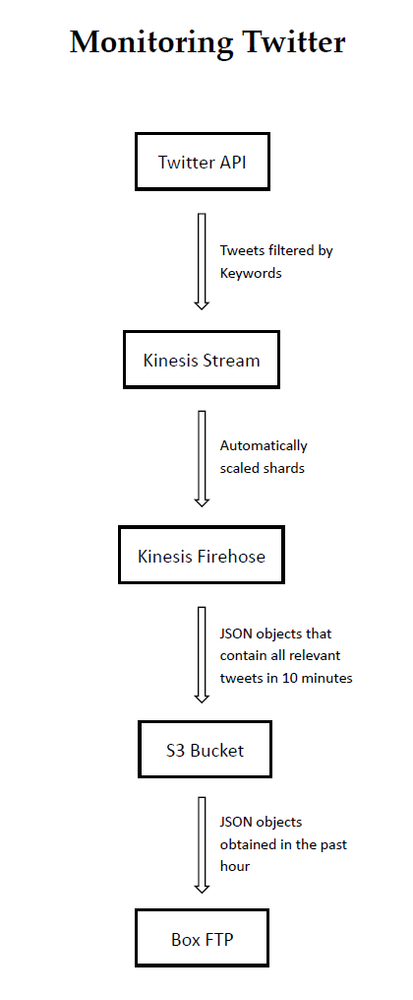

# MonitoringTwitter
Monitoring Twitter Project - The Division of Humanities and Social Sciences, California Institute of Technology

#### Table of contents

1. [Section 1](## Process)
2. [Section 2](#section-2)
    - [Subsection a](#subsection-a)
    - [Subsection b](#subsection-b)

## Process

### 1.	Requesting Twitter stream from Twitter API
Use twitter developer’s credentials to request real time twitter stream and filter the stream using keywords of interest.

[Put_Tweets_in_Kinesis_Stream.py](./Put_Tweets_in_Kinesis_Stream.py)

### 2.	Putting filtered tweets in shards of Kinesis stream
Put tweets that are relevant to target keywords in Kinesis stream. Specifically, the tweets are labeled by partition keys and directed to available shards. Each shard is a data timeline, it gives us access to data that were put in the stream as early as 24 hours ago. The writing limit of a shard is 1000 records/s and 1 MB/s.

[Put_Tweets_in_Kinesis_Stream.py](./Put_Tweets_in_Kinesis_Stream.py)

### 3.	Automatically scaling the number of shards
Monitor usage of each shard and automatically close a redundant shard or open a new shard if incoming data are exceeding the limit.

[Scale_Shards.py](./Scale_Shards.py)

### 4.	Storing the tweets in Kinesis stream to an S3 bucket
Put all tweets got from the past 10 minutes in a JSON file and store it in an S3 bucket. The reading limit of a shard is 2 MB/s.

### 5.	Pushing the JSON files in S3 bucket to a Box folder
Every hour, the new JSON files in the S3 bucket are pushed to Box FTP, so that the target Box folder will be updated once an hour and is available to all team members.

[Send_S3_Files_to_Box_FTP.py](./Send_S3_Files_to_Box_FTP.py)

## Tools
[Search_Tweets_from_REST_API.py](./Search_Tweets_from_REST_API.py)

[Parse_Kinesis_Stream_to_MariaDB.py](./Parse_Kinesis_Stream_to_MariaDB.py)

[Read_JSON_Files.py](./Read_JSON_Files.py)
